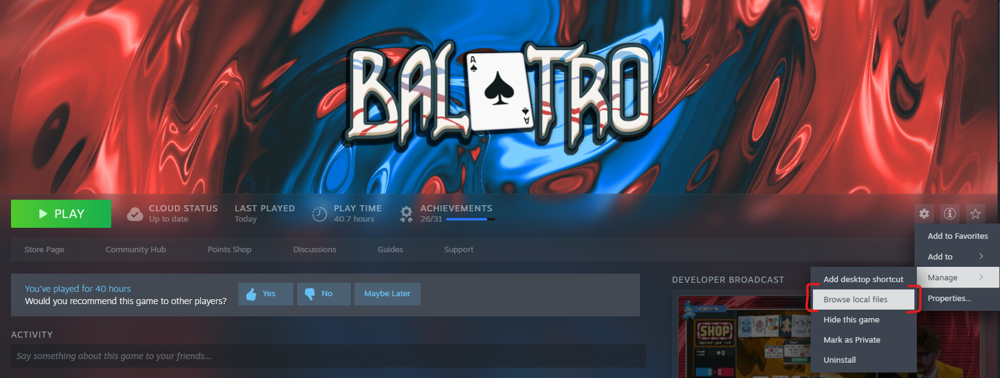
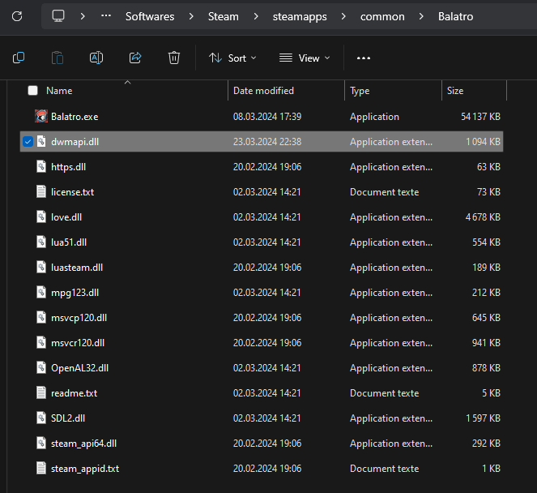

# Jack's [Balatro](https://store.steampowered.com/app/2379780/Balatro/) Modpack

### Disclaimer

1. I did not make any of the mods within the modpack. I only made a simple way to install all those mode for you to enjoy. You'll find [below](#mod-list) all the devs that created the different mods.
2. This modpack is unstable as Balatro's modding only started few weeks ago.
3. If the Modpack is really unplayable, please open an issue or contact me directly on discord (@jackowheel), I'll adjust the mods.

## Installation

You'll need git ([Windows](https://git-scm.com/download/win), [Linux](https://git-scm.com/book/en/v2/Getting-Started-Installing-Git)) installed on your machine to install the modpack.

### Windows installation script
```shell
git clone https://github.com/jubnl/Jacks-Balatro-Modpack.git --recurse-submodules Mods
cd Mods
setup-windows.bat
cd ..
xcopy ".\Mods" "%appdata%\Balatro\Mods" /E /H /C /I
```

### Linux installation script
```shell
git clone https://github.com/jubnl/Jacks-Balatro-Modpack.git --recurse-submodules Mods
cd Mods
./setup-linux.sh
cd ..
cp -r ./Mods /home/$USER/.local/share/Steam/steamapps/compatdata/2379780/pfx/drive_c/users/steamuser/AppData/Roaming/Balatro
```

### Install [Lovely Injector](https://github.com/ethangreen-dev/lovely-injector)
Find the latest release of the [Lovely-Injector](https://github.com/ethangreen-dev/lovely-injector/releases) and download
the file called `dwmapi.dll`. Once downloaded, put this file in the same folder as Balatro.exe.\
To find where the executable is stored you can click here:

Your folder should now look like this:



You can now launch Balatro ! Enjoy !

## Update the modpack

### Windows
```shell
cd Mods
upgrade-windows.bat

```

## Disable a mod
To disable a mod, go to the copied Mods folder and delete the corresponding mod folder at the root of the Mods folder.

# Agreement from the modders
You can find links to the modders agreement to be featured in this modpack in the [agreements file](./agreements/agreements.txt)

# Mod list
- [Steamodded](https://github.com/Steamopollys/Steamodded) - A Balatro ModLoader. by [@Steamo](https://github.com/Steamopollys)
- [Mika's Mod Collection](https://github.com/MikaSchoenmakers/MikasBalatro) - A collection of 7 decks and 31 jokers. by [@Mikadoe](https://github.com/MikaSchoenmakers)
- [Better Mouse And Gamepad](https://github.com/Kooluve/Better-Mouse-And-Gamepad) - Make mouse and gamepad more efficient and easier to use. For example multiply select cards by holding and dragging right mouse button. by [@Kooluve](https://github.com/Kooluve)
- [Collection Fix](https://github.com/GoldenEpsilon/Balatro_CollectionFix) - Fixes the collection to work with amounts of cards that aren't the base game's. by [@Golden Epsilon](https://github.com/GoldenEpsilon)
- [Divvy's Preview](https://github.com/DivvyCr/Balatro-Preview) - Simulate and preview the score that your hand will get! [@DivvyCr](https://github.com/DivvyCr)
- [Jimbo's Histories | Run Reviewer](https://github.com/Mi1cK/Jimbos-Histories) - Review run after it has ended. by [@MilcK](https://github.com/Mi1cK)
- [5 legendary challenges & Betmma Jokers](https://github.com/betmma/my_balatro_mods) - 5 more challenges, each featuring a legendary joker & 5 More Jokers! by [@Betmma](https://github.com/betmma)
- [JankJonklers](https://github.com/spikeof2010/JankJonklers) - A small pack of Jokers for the game. by [@Lyman](https://github.com/spikeof2010)
- [JellyMod](https://github.com/jamesthejellyfish/JellyMod) - A pack of 17 Jokers and 22 new "reverse" tarot cards. by [@JamestheJellyfish](https://github.com/jamesthejellyfish)
- [LushMod](https://github.com/lusciousdev/LushMod) - Pack with 9 jokers with some interesting effects. by [@lusciousdev](https://github.com/lusciousdev)
- [MoreFluff](https://notmario.github.io/MoreFluff/) - Adds more jokers to the game, by [@notmario](https://github.com/notmario)
- [MultiJokers](https://github.com/iJohnMaged/multi-jokers) - Adds a couple of custom jokers to the game. by [@John Maged](https://github.com/iJohnMaged), `@Multi`, `@GoldenEpsilon`
- [GoldenChallenge](https://github.com/Mysthaps/BalatroMods) - Adds the challenge "Golden". by [@Mysthaps](https://github.com/Mysthaps)
- [Myst's Boss Blinds](https://github.com/Mysthaps/BalatroMods) - A pack of Blinds. by [@Mysthaps](https://github.com/Mysthaps)
- [Silver Seal](https://github.com/mwithington/SilverSeal) - A mod for Baltro that adds in a silver seal which will apply a random edition to the card. Once the card is played a second time a new edition will be applied. The edition will only count after you have played the card atleast once. [@mwithington](https://github.com/mwithington), `@AxBolduc`
- [Green Seal](https://github.com/AxBolduc/GreenSeal) - Add a green seal which will increase the hand size for a given round by 1 when discarded. A card with the green seal will also apply a X0.75 mult if the card is scored. by [@AxBolduc](https://github.com/AxBolduc)
- [Card Back Injection](https://github.com/Ken-Shi/Balatro_CardBackInjection) - systematically loads all the card back files into the system. by [@Kenny Stone](https://github.com/Ken-Shi)
- [Themed Jokers](https://github.com/BlizzowX/Balatro---Themed-Jokers) - A bunch of themed Jokers. *WIP*. by [@Blizzow](https://github.com/BlizzowX)
- [Sylvie's Silliness](https://github.com/NewtTheFish/SylvieSilly) - A few decks, jokers, etc. Have fun! by [@NewtTheFish](https://github.com/NewtTheFish)
- [FederAPI](https://github.com/itayfeder/FederAPI-Balatro) - An API library mod that allows to register vouchers, blinds, tarots, sounds, etc. by [@itayfeder](https://github.com/itayfeder)

### Thanks a lot to [@jie65535](https://github.com/jie65535) for your [Mod list](https://github.com/jie65535/awesome-balatro)!
